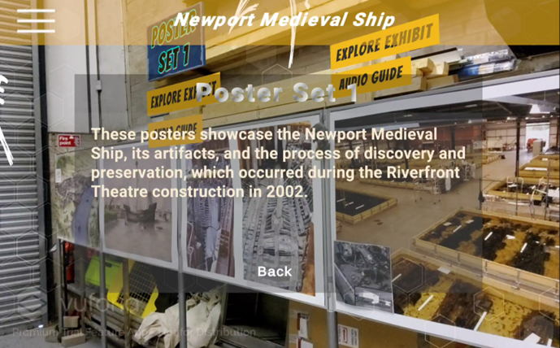
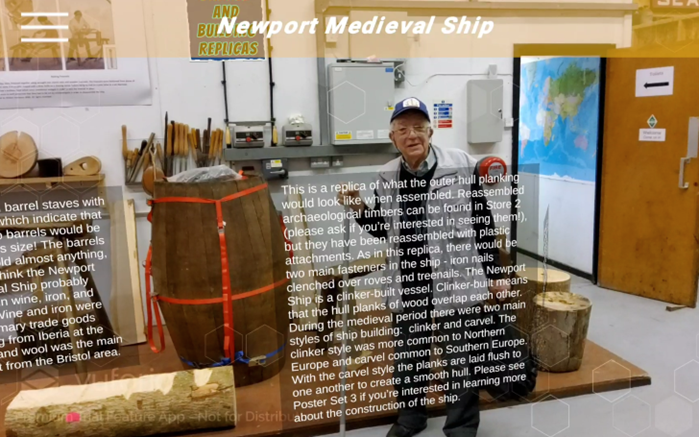
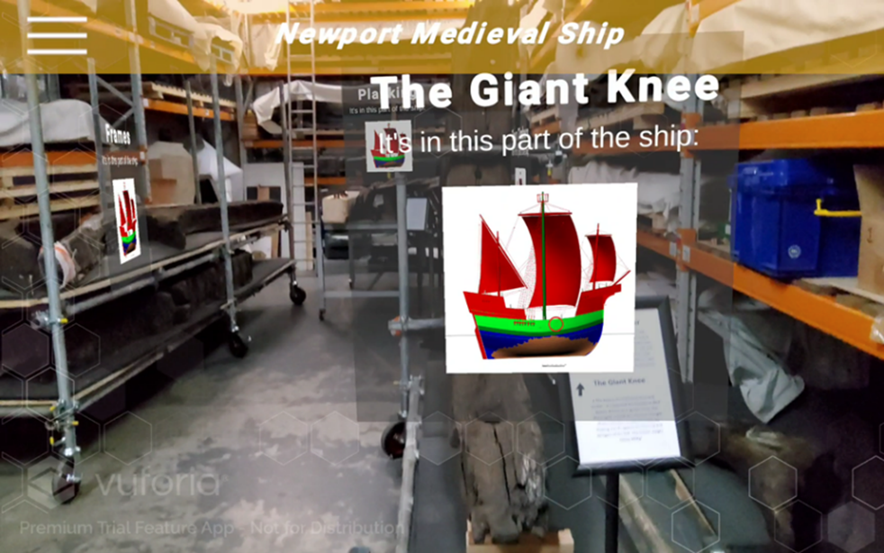
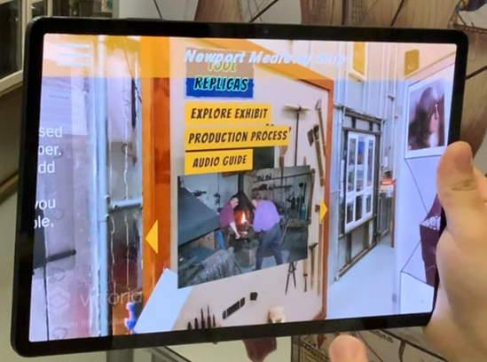
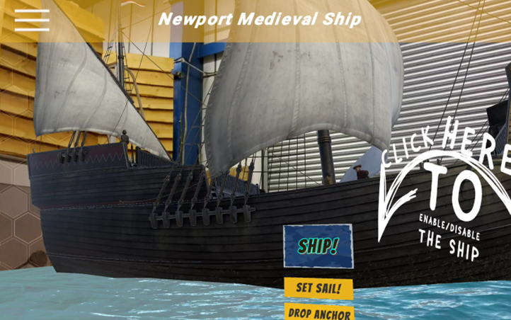
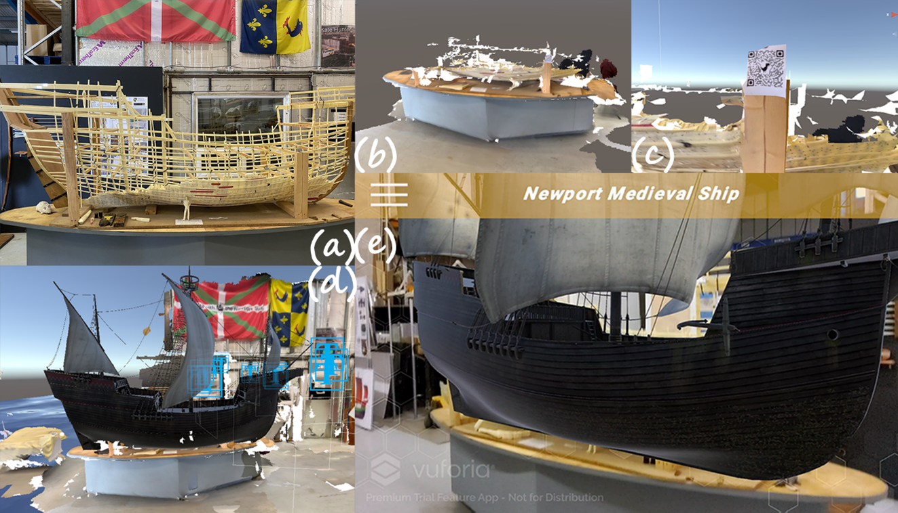

**<h1>NewportShipAR</h1>**

**<h2>Project Overview</h2>**

This is a study investigating the feasibility of self-guided AR applications and exploring how AR enhances the visitor experience.
The experimental equipment is set to be the Samsung S7+ tablet, and the AR application was developed using Unity platform with Vuforia SDK. The specific versions include Unity 2022.3.4f1 and Vuforia 10.17.4.

Link to youtube:
https://youtu.be/i0YkQLhWg-M

**<h2>Research Description</h2>**
The survey will inquire about users' perceptions of different media elements from various perspectives, with a particular focus on the unique experiences brought about by AR functionality. The feasibility and experiential enhancement provided by the AR self-guided application will be validated. Specifically, the following aspects will be considered:

**Text Perception:** Understanding how participants perceive the real world and text displayed on the screen.

**AR Experience:** Evaluating participants' satisfaction with AR elements and their impact on museum tours.

**App Usage and Interaction:** Investigating the use of the standalone application and identifying challenges in the interaction process with AR features.

**Overall User Experience:** Collecting feedback regarding UI, UX, and overall immersion to assess the impact of the tour.

**<h2>Experimental Design</h2>**

For the Poster Set area, text is displayed on the screen because there is no suitable physical space in this real-world area to effectively showcase the text. The content of the text is set to provide basic information about each poster. 

All text is limited to a maximum of three sentences. In contrast, audio descriptions provide more comprehensive information. The duration of the audio typically ranges from 20 to 50 seconds. It's important to note that all these audio descriptions are generated using freely available text-to-speech websites.

For the Barrel and Building Replicas area, a real-world text display method is employed. Each text panel is positioned next to its corresponding object, allowing users to better associate each text with the object compared to on-screen text. To provide a contrast, three text modes were implemented in this area: minimal text, moderate text, and extensive text. This is an attempt to evaluate the different experiences resulting from varying amounts of text(for my research).

You can see which parts of the ship each of these woods belongs to in the Timber Storage room.

You can view the images and switch between them using the buttons.

You can watch the animation of the ship's voyage in the Poster Set 1 area. In Unity, I have enlarged the ship's model beyond its original size, but it still appears smaller than the 1:1 scale. This is likely because, for some reason, the ship is actually quite far away from us and not easily noticeable in the virtual perspective, making it appear smaller. If the model is set to be extremely large, we can achieve the 1:1 effect, but it doesn't display well on the screen. So, you can just explain to visitors that this is indeed a 1:1 scale; it's just positioned quite far away, making it appear smaller than expected.

(a) is a 3D printed model in the real world, (b) demonstrates that it cannot be scanned, (c) is the QR code used to supplement feature points, (d) illustrates the design process, and (e) shows the final presentation in the real world.
